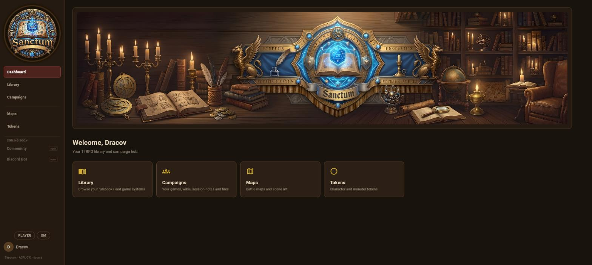
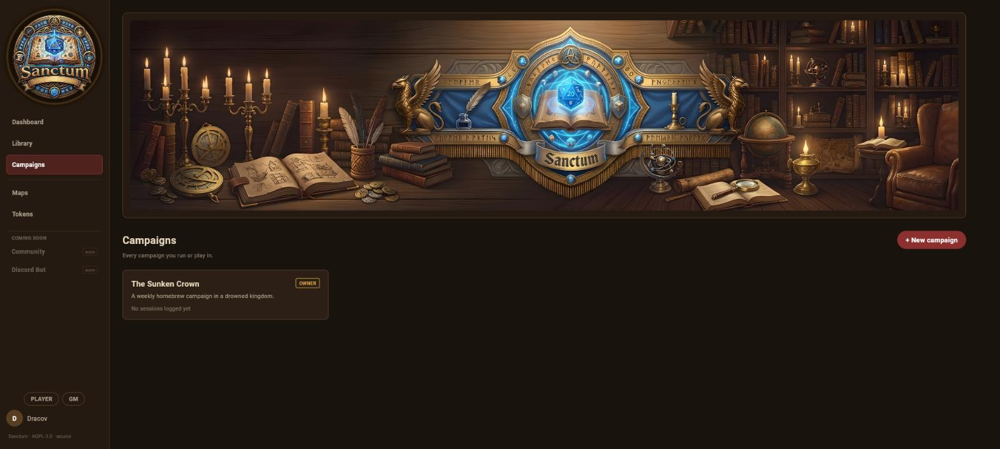
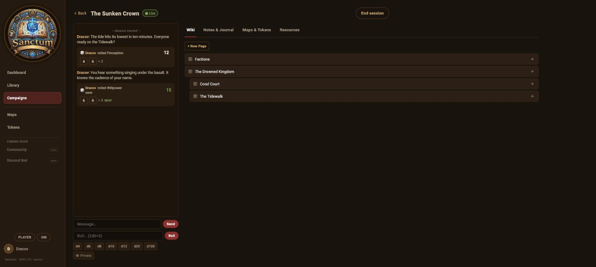

# Sanctum

[](https://github.com/dracov314/sanctum/actions/workflows/ci.yml)
[](https://ko-fi.com/untrustedhub)

A self-hosted TTRPG library and campaign hub — rulebook reader, campaign wikis,
maps, tokens, and a live session room.

Browse your rulebooks, read PDFs in-app with a real text index and search, keep
per-campaign wikis, maps, and tokens, and run games with your table. Fully
self-contained — nothing is fetched from a third party at runtime.

Released under **AGPL-3.0**.

## Screenshots

| | |
|---|---|
|  |  |
| ![Campaign wiki — Markdown with `[[wiki links]]` and page hierarchy](docs/screenshots/wiki.jpg) |  |

## Status

**v1.0.0.** The core is complete and stable: a game-system library with a real
PDF reader (text index, search, OCR), per-campaign wikis, maps and tokens, a
system-agnostic live session room, account management, and guest / invite
access. It runs a live game group off a private trunk, and the public build
tracks that trunk.

On the roadmap:

- **Game-system plugin API** — Sanctum already routes game-system modules
  through a small seam (`frontend/lib/game_systems_api.dart`); the goal is to
  make it rich enough that a full system (character sheets, dice/combat rules,
  advancement) drops in as a module. The maintainer's own system stays private;
  the seam is public.
- **Library** — richer metadata editing, bulk ingestion, deeper per-system
  organisation.
- **Reader** — text-selection bookmarks, `dart:html` → `package:web` migration.
- **Service-account `dev` tier** — the automation login gains an opt-in
  `/dev/*` diagnostics namespace in a later release.

Issues and PRs welcome.

## What's included

- **Library** — game-system grid, per-system book browsing, PDF reader with
  paged/spread view, table of contents, bookmarks, and full-text search
  (Sanctum does its own text extraction + OCR).
- **Campaigns** — members, per-campaign wiki (Markdown + `[[wiki links]]` +
  page hierarchy), resources, session notes, file attachments.
- **Maps & Tokens** — upload, tag, and favourite battle maps and token art.
- **Session Room** — a live, system-agnostic play screen: shared activity feed,
  chat, an `NdM+K` dice roller with quick-roll buttons and private rolls, and
  GM session start/end. A game system can register its own focused room.
- **Accounts** — local username/password, any external OpenID Connect
  provider (auto-discovered, no specific IdP required), or both. Optional
  service/automation account for CI, monitoring, or an assistant.
- **Discord bot** (optional) — session-room roll relay and session logging.

## What's *not* included

The per-game-system automation layer (character sheets, the dice/combat
engine, system-specific rules tooling) and the maintainer's private PDF
library and campaign data are not part of this repository. Sanctum is built so
a game system plugs in through the module seam
(`frontend/lib/game_systems_api.dart`); this edition ships with none.

## Quick start

```sh
git clone https://github.com/dracov314/sanctum.git && cd sanctum
./setup.sh                 # writes .env with generated secrets
# review .env (BASE_URL, SANCTUM_PORT, AUTH_MODE), then:
docker compose up -d --build
```

(`setup.sh` just fills `.env` from `.env.example` with random
`POSTGRES_PASSWORD` / `SECRET_KEY`; do it by hand if you prefer.)

Open `http://localhost:8080` (or your `BASE_URL`). **The first account you
register becomes the admin.** Set `ALLOW_REGISTRATION=false` in `.env` and
`docker compose up -d` again once your accounts exist.

### Adding books

An admin can upload PDFs from **Library → Add book** (filed under a game
system, indexed automatically). You can also drop files straight into the
`library` volume at `/library/books/<system>/` and hit **Library → Scan**.

### Discord bot (optional)

Fill `DISCORD_BOT_TOKEN` + `BOT_API_KEY` in `.env`, then:

```sh
docker compose --profile bot up -d
```

See [`bot/README.md`](bot/README.md).

## Requirements

- Docker + Docker Compose
- ~2 GB RAM, plus disk for your PDF library

## License

AGPL-3.0. See [`LICENSE`](LICENSE). If you run a modified version as a network
service, you must offer your users the corresponding source.
